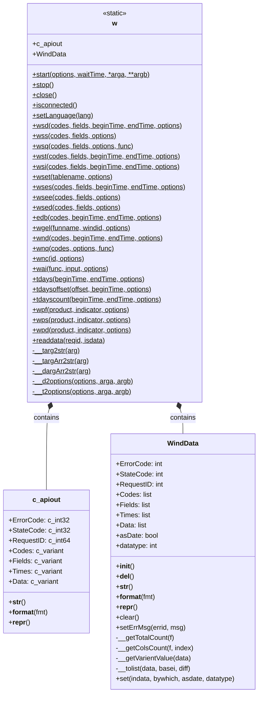

```mermaid
classDiagram
    class w {
        <<static>>
        +c_apiout
        +WindData
        +start(options, waitTime, *arga, **argb)$
        +stop()$
        +close()$
        +isconnected()$
        +setLanguage(lang)$
        +wsd(codes, fields, beginTime, endTime, options)$
        +wss(codes, fields, options)$
        +wsq(codes, fields, options, func)$
        +wst(codes, fields, beginTime, endTime, options)$
        +wsi(codes, fields, beginTime, endTime, options)$
        +wset(tablename, options)$
        +wses(codes, fields, beginTime, endTime, options)$
        +wsee(codes, fields, options)$
        +wsed(codes, fields, options)$
        +edb(codes, beginTime, endTime, options)$
        +wgel(funname, windid, options)$
        +wnd(codes, beginTime, endTime, options)$
        +wnq(codes, options, func)$
        +wnc(id, options)$
        +wai(func, input, options)$
        +tdays(beginTime, endTime, options)$
        +tdaysoffset(offset, beginTime, options)$
        +tdayscount(beginTime, endTime, options)$
        +wpf(product, indicator, options)$
        +wps(product, indicator, options)$
        +wpd(product, indicator, options)$
        +readdata(reqid, isdata)$
        -__targ2str(arg)$
        -__targArr2str(arg)$
        -__dargArr2str(arg)$
        -__d2options(options, arga, argb)$
        -__t2options(options, arga, argb)$
    }

    class c_apiout {
        +ErrorCode: c_int32
        +StateCode: c_int32
        +RequestID: c_int64
        +Codes: c_variant
        +Fields: c_variant
        +Times: c_variant
        +Data: c_variant
        +__str__()
        +__format__(fmt)
        +__repr__()
    }

    class WindData {
        +ErrorCode: int
        +StateCode: int
        +RequestID: int
        +Codes: list
        +Fields: list
        +Times: list
        +Data: list
        +asDate: bool
        +datatype: int
        +__init__()
        +__del__()
        +__str__()
        +__format__(fmt)
        +__repr__()
        +clear()
        +setErrMsg(errid, msg)
        -__getTotalCount(f)
        -__getColsCount(f, index)
        -__getVarientValue(data)
        -__tolist(data, basei, diff)
        +set(indata, bywhich, asdate, datatype)
    }

    w *-- c_apiout : contains
    w *-- WindData : contains
```